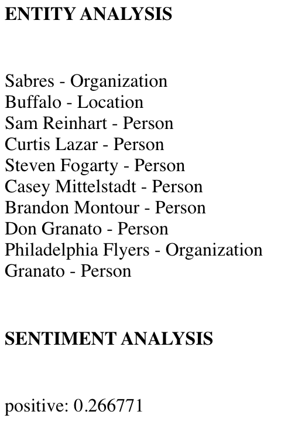
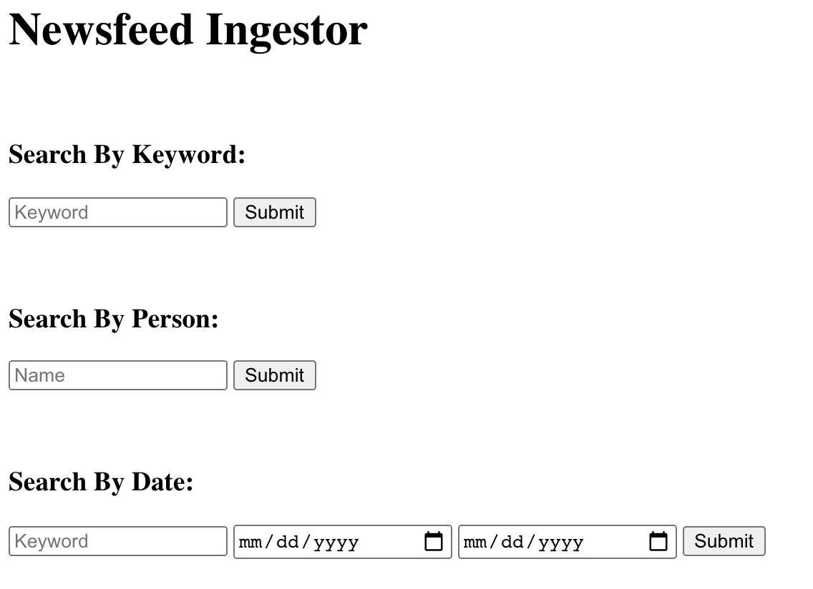

# Final Result and Testing Examples

## *Note:* 
Please disregard the *test_HW2.py* file as it is outdated. I wasn't sure how to unit test variable inputs where the input parameter is a file / paragraph of text since it would be a huge mess, and the expected output is usually a HTML formatted string instead of something simple like status update or a number. 

What I have done to demonstrate my project is first show what the UI looks like, then show the outputs of each of the API's functions.

### Home Page

 

### Database Setup

 

### File Upload API

 

- upload(test.pdf): The input PDF file can be found in the root of this repo. The output here on a successful upload is: *Successfully uploaded file*. Otherwise, an error message is returned for either a failed database connection or an invalid filetype. In this case the entry will go in the database with ID 2.
 

- read(2): The input is the ID of file entry in the database. The output is the parsed PDF from the database.

 

- update(2, "data", "overwritten"): The input is the ID of the entry in the database, the entries field you want to overwrite(filename, upload_date, data), and the new value. The output on a successful update is: *Successfully updated file*. Otherwise, an error message is returned for either a failed database connection or invalid entry field.
 

- delete(2): The input is the ID of entry in the database. The output for a successful deletion of an entry is: *Successfully deleted file*. Otherwise, an error message is returned for failed database connection. In the case of an invalid database ID, it still returns a success, but the database is not modified.
 

### NLP API

 

#### NOTE:
The *input* string for the NLP functions here is the text from the article at this URL: 
https://www.espn.com/nhl/story/_/id/31174707/buffalo-sabres-beat-philadelphia-flyers-snap-18-game-winless-streak

- getEntities(*input*): The input is text from the article URL mentioned above. The output is an HTML formatted string, showing the determined entities and their type. 

 

- getSentiment(*input*): The input is the text from the article URL mentioned above. The output is an HTML formatted string. showing the sentiment and its confidence. 

 

- getEntitySentiment(*input*): The input is the text from the article URL mentioned above. The output is a combination of the above two functions. 

 

- getClassification(*input*): The input is the text from the article URL mentioned above. The output is an HTML formatted string, showing the determined categories and the confidence. 

 

### Newsfeed API

 

- queryKeyword("march madness"): The input is some term you want articles on. The output is an HTML formatted string, showing a list of relevant articles, up to 10 most recent.

 

- queryPerson("Barack Obama"): The input is some name you want articles on. The output is an HTML formatted string, showing a list of relevant articles, up to 10 most recent.

 

- queryHistorical("march madness", "2018-3-15", "2018-4-7"): The input is some term you want articles on, and starting and ending dates for some time period to search between. The output is an HTML formatted string, showing a lost of relevant articles, up to 10.
